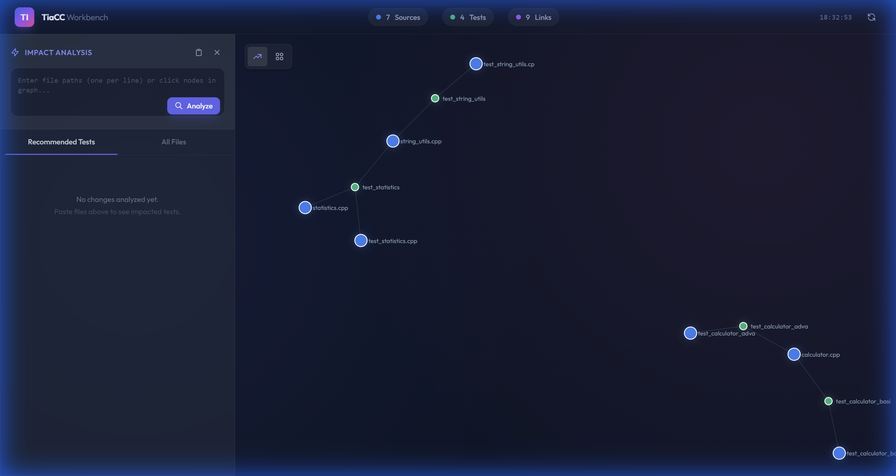
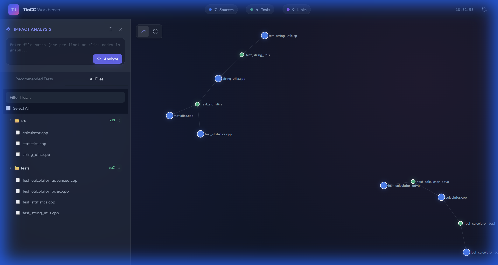
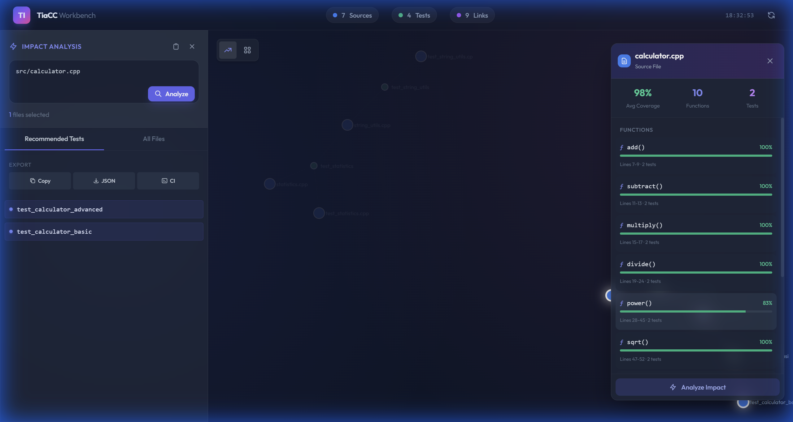

# TiaCC - Test Impact Analysis for Code Coverage

<div align="center">


### Run Only Affected Tests, Make CI Lightning Fast

**Reduce 30-minute full test runs to 5 minutes**

[Quick Start](#-quick-start) |
[How It Works](#-how-it-works) |
[Dashboard](#-interactive-dashboard) |
[Docs](docs/architecture.md)

[Chinese Version](README.md)

</div>

---

## Sound Familiar?

| Pain Point | Description |
|------------|-------------|
| **Slow CI** | Every commit waits 30+ minutes for full test suite |
| **Wasted Resources** | Changed one line, runs thousands of unrelated tests |
| **Slow Feedback** | Submit PR, grab coffee, still waiting... |
| **Redundant Work** | Passed locally, CI runs everything again |

## How TiaCC Solves This

<div align="center">

```
┌─────────────────────────────────────────────────────────────────────────┐
│                                                                         │
│     Traditional Way                     TiaCC Way                       │
│     ───────────────                     ──────────                       │
│                                                                         │
│     Changed calculator.cpp             Changed calculator.cpp           │
│            ↓                                  ↓                         │
│     Run 1000+ tests                    Smart analysis: Which tests      │
│            ↓                           cover this file?                 │
│     Wait 30 minutes                           ↓                         │
│            ↓                           Recommend only 2 relevant tests  │
│     ...                                       ↓                         │
│                                        Done in 3 minutes!               │
│                                                                         │
└─────────────────────────────────────────────────────────────────────────┘
```

</div>

### Core Principle

TiaCC builds source-to-test mappings through **code coverage analysis**:

```
1. Nightly Build: Run full test suite, record which tests cover which files
                   ↓
2. Generate Mapping DB: calculator.cpp ← test_calc_basic, test_calc_advanced
                         statistics.cpp  ← test_statistics
                   ↓
3. PR Submission: Detect which files you changed
                   ↓
4. Smart Recommendation: Run only affected tests!
```

## Interactive Dashboard

TiaCC provides a beautiful Web Dashboard to **visualize** code-test relationships:

### Dependency Graph

Intuitive view of source files (blue) and tests (green) relationships:

<div align="center">

</div>

### Smart File Management

Folder grouping with aggregate coverage, clear at a glance:

<div align="center">

</div>

### Function-Level Analysis

Click any source file to see function-level coverage details:

<div align="center">

</div>

## Quick Start

### 30-Second Dashboard Demo

```bash
# 1. Clone the repo
git clone https://github.com/YourUsername/TiaCC.git  # Replace with your fork
cd TiaCC

# 2. Start Dashboard (with sample data)
cd dashboard
python -m http.server 8080

# 3. Open browser
# http://localhost:8080/
```

### Using in Your Project

#### Step 1: Install TiaCC CLI

```bash
# Ensure .NET 8.0+ is installed
dotnet --version

# Build TiaCC CLI
cd tools-dotnet
dotnet build -c Release
```

#### Step 2: Nightly - Build Mapping Database

```bash
# 1. Run tests with coverage collection
dotnet test --collect:"XPlat Code Coverage" --results-directory ./coverage

# 2. Initialize database
dotnet run --project TiaCC.Cli -- init --db impact_map.db

# 3. Map coverage data
dotnet run --project TiaCC.Cli -- map \
  --db impact_map.db \
  --coverage ./coverage/*/coverage.cobertura.xml \
  --test MyTestClass
```

#### Step 3: PR Time - Get Recommended Tests

```bash
# Query affected tests
dotnet run --project TiaCC.Cli -- query \
  --db impact_map.db \
  --files src/MyService.cs

# Example output:
# Affected tests:
#   - MyServiceTests
#   - IntegrationTests
```

## Results Comparison

| Metric | Traditional | With TiaCC |
|--------|-------------|------------|
| CI Time | 30 minutes | **3-5 minutes** |
| Tests Run | 1000+ | **2-10** |
| Developer Feedback | 30 min after commit | **3 min after commit** |
| Compute Resources | 100% | **5-10%** |

## Typical Use Cases

### Use Case 1: Daily Development

```bash
# Modified MathService.cs
git diff --name-only
# → src/MathService.cs

# Query affected tests
dotnet run --project tools-dotnet/TiaCC.Cli -- query \
  --db impact_map.db \
  --files src/MathService.cs
# → MathServiceTests

# Run only this test
dotnet test --filter "FullyQualifiedName~MathServiceTests"
```

### Use Case 2: CI/CD Integration

```yaml
# .github/workflows/pr.yml
- name: Get affected tests
  run: |
    dotnet run --project tools-dotnet/TiaCC.Cli -- query \
      --db impact_map.db \
      --files $(git diff --name-only origin/main) \
      > affected_tests.txt

- name: Run affected tests
  run: |
    FILTER=$(cat affected_tests.txt | tr '\n' '|' | sed 's/|$//')
    dotnet test --filter "FullyQualifiedName~$FILTER"
```

### Use Case 3: Dashboard Analysis

1. **Visual Exploration** - Understand code-test dependencies
2. **Function-Level Targeting** - Find low-coverage functions
3. **Impact Analysis** - See which tests a file change affects

## Supported Tech Stack

| Type | Support |
|------|---------|
| **Languages** | C++ (LLVM), C# (Coverlet/.NET), Java (JaCoCo), Python (coverage.py), Lua (LuaCov) |
| **Coverage Formats** | LLVM Profile, Coverlet, Cobertura, OpenCppCoverage, LCOV/gcov, JaCoCo, dotCover, LuaCov |
| **Test Frameworks** | xUnit, NUnit, MSTest, pytest, go test, busted, and more |
| **Platforms** | Windows, Linux, macOS |
| **Analysis Level** | File-level, Function-level |

## Project Structure

```
TiaCC/
├── dashboard/           # Web visualization Dashboard
├── tools-dotnet/        # .NET CLI tools (mapper, recommend)
├── clients/             # Multi-language test framework clients
├── src/
│   ├── cpp/             # C++ coverage collection
│   └── dotnet/          # C# coverage collection
├── tests/e2e/           # End-to-end verification tests
└── docs/                # Detailed documentation
```

## Documentation

| Document | Description |
|----------|-------------|
| [Architecture](docs/architecture.md) | System architecture, data flow, Dashboard features |
| [Integration Guide](docs/integration-guide.md) | How to integrate into your project |
| [E2E Tests](tests/e2e/README.md) | End-to-end verification tests |

## Contributing

Contributions welcome! Please read [CONTRIBUTING.md](CONTRIBUTING.md) to learn how.

## License

MIT License - See [LICENSE](LICENSE)

---

<div align="center">

**If TiaCC helped you, please give it a Star!**

Made with by the TiaCC Team

</div>
